

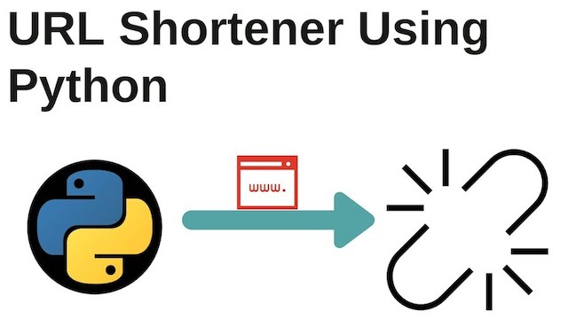

<h1 align="center">Python URL Shortener Deployment 4<h1>

# Purpose

This deployment is set up to build out a web server instance to deploy a web application via a CI/CD pipeline. Monitoring and stress testing will be performed on the infrastructure to observe performance.

The server will run using nginx as the webserver, Jenkins for the CI/CD pipeline, and Datadog for performance monitoring.

## Deployment Files:

The following files are needed to run this deployment:

- `application.py` The main python application file
- `test_app.py` Tests used to test application functionality; used in Jenkins Test phase
- `requirements.txt` Required packages for python application
- `urls.json` Test URLS for application testing
- `Jenkinsfile` Configuration file used by Jenkins to run a pipeline
- `README.md` README documentation
- `static/` Folder housing CSS files
- `templates/` Folder housing HTML templates
- `images/` Folder housing deployment artifacts

# Steps

1.  Launch an EC2 Instance and install Jenkins

    - Jenkins, an open-source software automation server, will be used to automate the process of pulling in the source code repository, building and running the application, and testing the application.
    - Install Jenkins Server using instructions at this [link](https://pkg.jenkins.io/debian/)
    - Install required software:
      - `sudo apt update && sudo apt upgrade`
      - `sudo apt install python3.10-venv python3-pip ngnix`
    - Browse to `http://<instance public IP>:8080` to access the Jenkins server
      - Follow on-screen instructions to complete initial login  

2.  Setup Pipeline Utility Steps plugin for Jenkins

    - The Pipeline Keep Running Step plugin provides functionality within the steps of a Jenkins pipeline. This plugin will keep the build process running after the build has completed.
    - From the Dashboard, go to Managed Jenkins > Plugins > Available plugins
    - **Search**: Pipeline Keep Running Step > Check box > Install
    - Verify installation under Installed plugins  

3.  Setup Multibranch Pipeline

    - From Jenkins Dashboard, select a new item > Create Name > Mulitbranch Pipeline option
      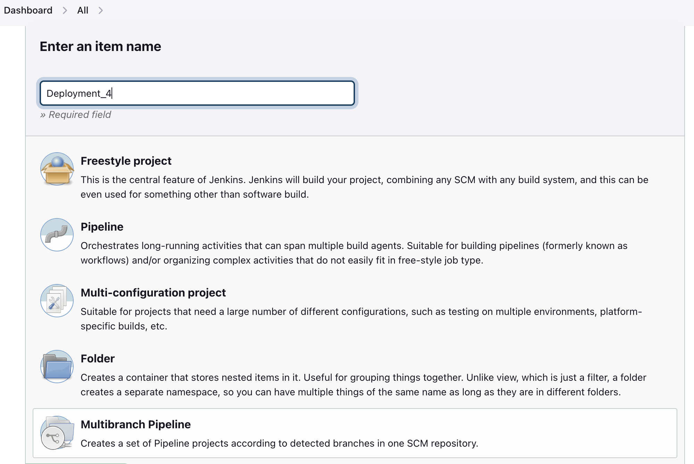 
    - Under Configuration > General, set branch source to ‘GitHub’ option
      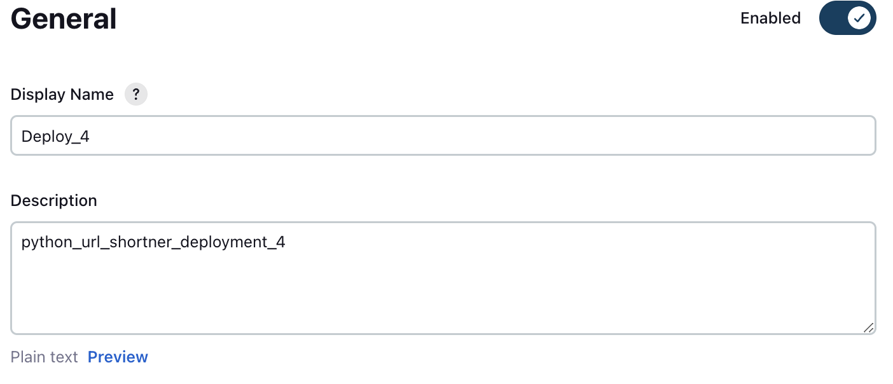 
    - Set Branch sources:
      - Credentials: [How to setup Github Access Token](https://docs.github.com/en/enterprise-server@3.8/authentication/keeping-your-account-and-data-secure/managing-your-personal-access-tokens)
      - Repository HTTPS URL: `<Github Repo URL>`
        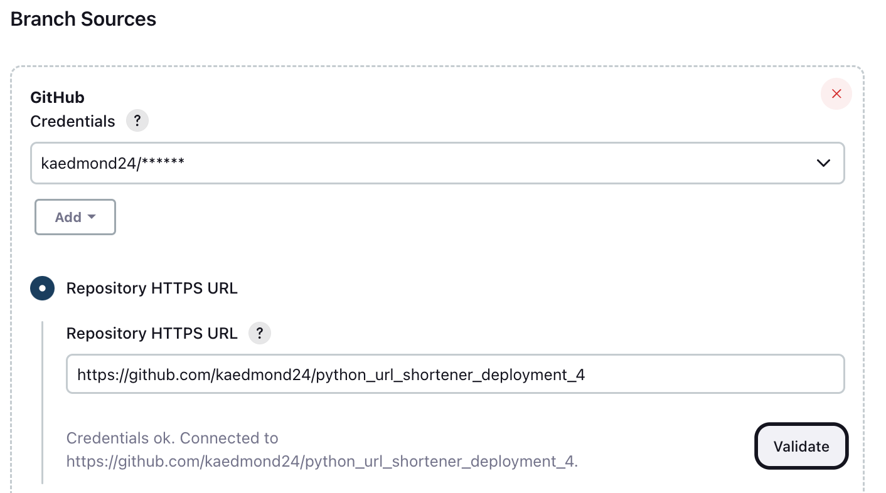 
    - Apply and Save  

4.  Setup Datadog monitoring

    - Login to Datadog or [sign-up for an account](https://www.datadoghq.com/free-datadog-trial/)
    - Setup Datadog agent for EC2 instance

      - Navigate to Integrations > Agent > Ubuntu
      - Select your API key
      - Save command for agent installation
      - On the EC2, run copied command to install Datatdog agent:

        > `DD_API_KEY=*******************************************`

        > `DD_SITE="us5.datadoghq.com"` > `DD_APM_INSTRUMENTATION_ENABLED=host`

        > `bash -c "$(curl -L https://s3.amazonaws.com/dd-agent/scripts/install_script_agent7.sh)"`

      - The agent will take several minutes before populating the dashboard.

    - From Datadog dashboard, navigate to Monitors > New Monitor > Metric Monitor

      - Choose detection method 
        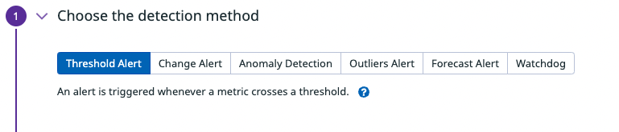  
      - Define the metric 
        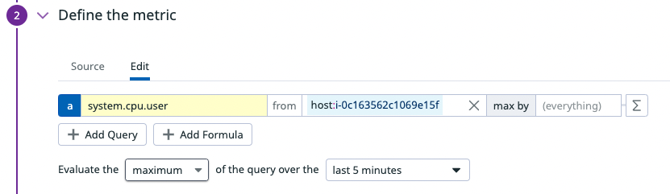  
      - Set alert conditions 
        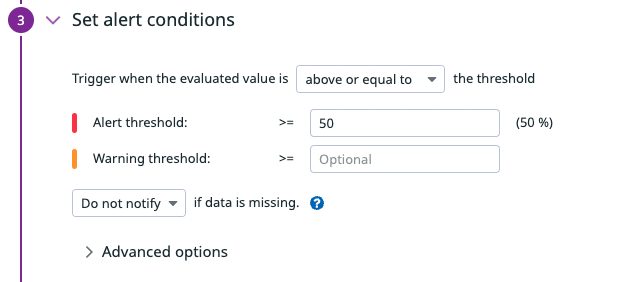  
      - Notify your team 
        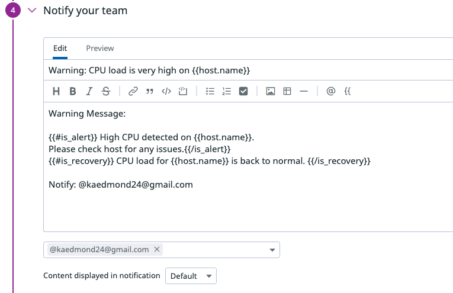  
          
      - Define permissions and audit 
        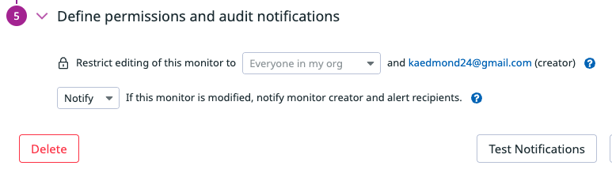  
        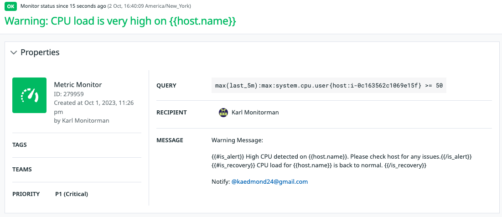  

5.  Update Nginx Configuration

    - On EC2, Update the nginx configuration file with correct listening port and location.
    - Open config file:

      > `sudo nano /etc/nginx/sites-enabled/default`

      > Set ports to 5000: `server { listen 5000 default_server; listen [::]:5000 default_server;}`

      > Set location: `location / { proxy_pass http://127.0.0.1:8000; proxy_set_header Host $host; proxy_set_header X-Forwarded-For $proxy_add_x_forwarded_for;}`

    - Save and close file
    - Reload nginx configuration
      > `sudo systemctl reload nginx.service`  

6.  Update Jenkins Pipeline file (jenkinsfile)

    - Update the jenkinsfile with new stages for pipeline build
      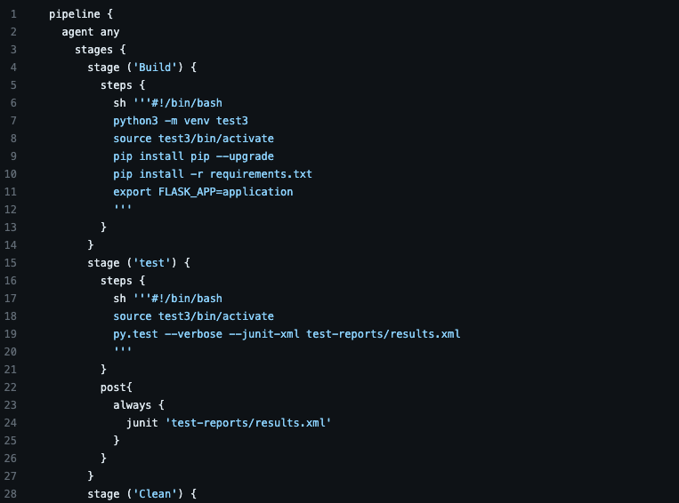 
        
    - Push changes to Github repository  

7.  Run Pipeline

    - In Jenkins, select Build Now
    - During the pipeline run we're lookng for a successful build and test.
      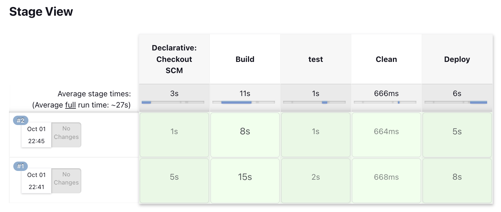  

8.  Review Datadog Metrics
    - From Datadog dashboard, navigate to Metrics > Explorer
    - The templates > home.html file was updated. A change was made to the block title updating "URL Shortener" to "PyD3 URL Shortener". Jenkins received the repo update via the wekhook post request and ran the pipeline.
      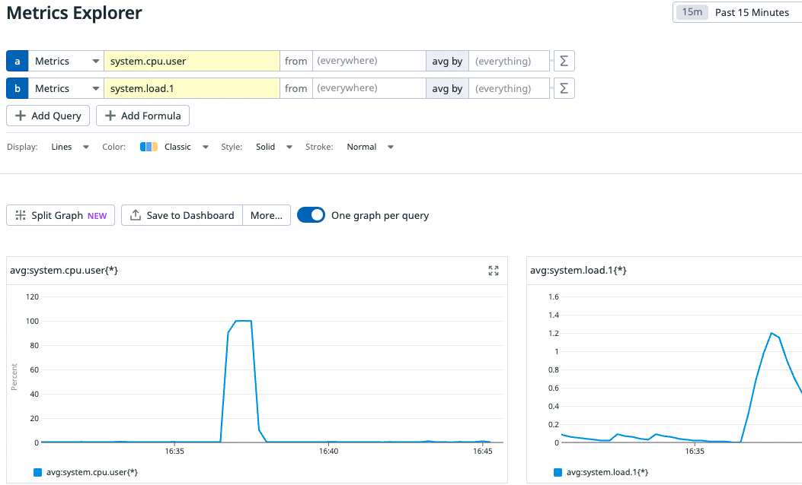  

# System Diagram

CI/CD Pipeline Architecture [Link](https://github.com/kaedmond24/python_url_shortener_deployment_4/blob/main/c4_deployment_4.png)

# Issues

No Issues Found

# Optimization

1. How is the server performing?

   The performance of the serve has been stable. Prior to running the first Jenkins pipeline build CPU average usage was low; hovering around 1%. There were a few expected spikes during installation of the required software.

2. Can the server handle everything installed on it? If yes, how would a T.2 micro handle this deployment?

   The server is able to handle the load of the installed software. Once setup was complete, the CPU utilization averaged about 1%. During the first run of the Jenkins pipeline build CPU utilization spiked to 52% before returning to 1% utilization after the build completed. Compared to the T2 medium specs (2 vCPU, 4 GiB Memory), I believe the T2 micro (1 vCPU, 1 GiB Memory) could handle this deployment. However, the process would take longer due to the resource disparity. The T2 micro’s CPU and memory would see higher resource utilization causing a slowdown in the processing of tasks.

3. What happens to the CPU when you run another build?

   During the second Jenkins pipeline build the CPU spiked to 41% usage before leveling out at 1% usage. I suspect during the first Jenkins pipeline build some initial tasks had to be complete causing a higher spike in CPU utilization. An example task would be the creation of the Jenkins pipeline‘s workspace environment.
